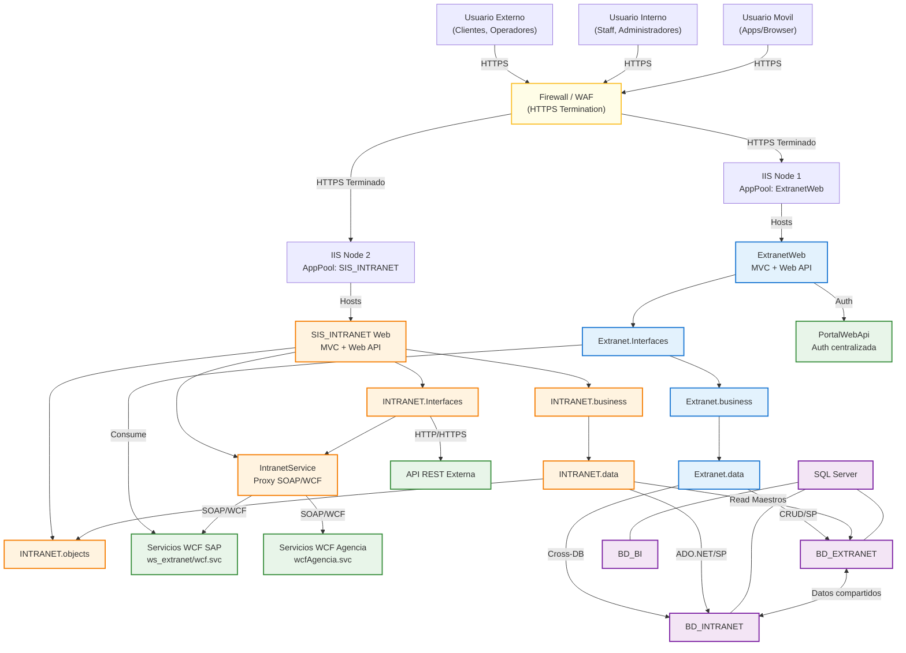
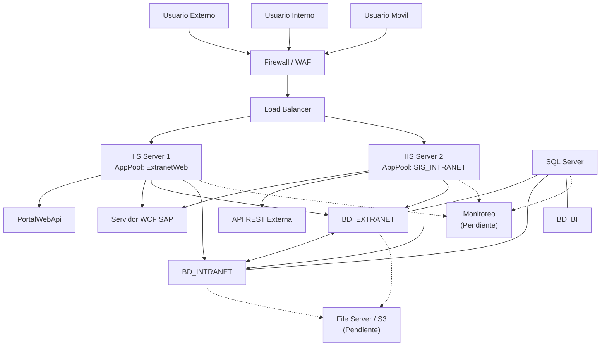

# UNIMAR - Arquitectura Unificada y Diagramas

## Documentación de Arquitectura

| Documento | Descripción | Enlace |
|-----------|-------------|--------|
| **Arquitectura Unificada** | Componentes combinados Extranet + Intranet, flujos de comunicación y zonas de seguridad | [ARQUITECTURA_UNIFICADA.md](docs/diagramas/ARQUITECTURA_UNIFICADA.md) |
| **Análisis de Arquitectura Unificada** | Mapeo de tiers, componentes compartidos/exclusivos, plan de consolidación | [ANALISIS_ARQUITECTURA_UNIFICADA.md](docs/diagramas/ANALISIS_ARQUITECTURA_UNIFICADA.md) |

## Diagramas de Arquitectura

### Despliegue Unificado

Diagrama de despliegue consolidado por tiers (5 niveles):

| Tier | Nombre | Componentes |
|------|--------|-------------|
| 0 | Externa/Internet | Usuarios (Externos, Internos, Móviles) |
| 1 | Perímetro/DMZ | Firewall/WAF, Granja IIS |
| 2 | Aplicación | ExtranetWeb, SIS_INTRANET, Capas Business/Data |
| 3 | Integración | Servicios WCF, PortalWebApi, APIs REST |
| 4 | Datos | SQL Server (BD_EXTRANET, BD_INTRANET, BD_BI) |

**Archivos:** [PlantUML](docs/diagramas/deployment_unificado.puml) / [Mermaid](docs/diagramas/deployment_unificado.mmd)

---

### Vista Física de Servidores

Topología física de servidores, zonas de red e infraestructura:

**Archivos:** [PlantUML](docs/diagramas/vista_fisica_servidores.puml) / [Mermaid](docs/diagramas/vista_fisica_servidores.mmd) / [Markdown](docs/diagramas/vista_fisica_servidores.md)

---

### Arquitectura Unificada

Diagrama de arquitectura consolidado (Extranet + Intranet):

**Archivos:** [PlantUML](docs/diagramas/arquitectura_unificada.puml)

---

## Cómo Visualizar los Diagramas

### PlantUML

| Método | Instrucciones |
|--------|--------------|
| **Online** | [Editor PlantUML](http://www.plantuml.com/plantuml/uml/) - Copiar y pegar contenido |
| **VS Code** | Instalar extensión "PlantUML" (jebbs) → Abrir archivo → `Alt+D` |
| **CLI** | `plantuml archivo.puml` |

### Mermaid

| Método | Instrucciones |
|--------|--------------|
| **Online** | [Editor Mermaid Live](https://mermaid.live/) - Copiar y pegar contenido |
| **VS Code** | Extensión "Markdown Preview Mermaid Support" |
| **GitHub** | Se renderiza automáticamente en archivos `.md` |
