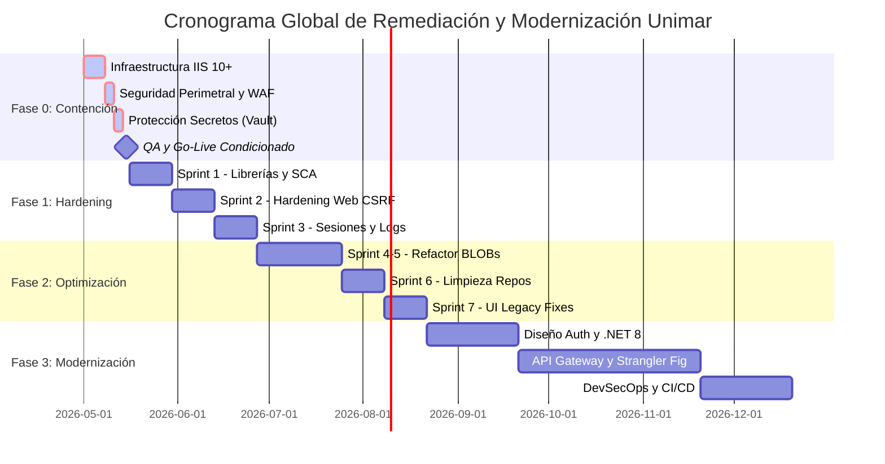

# Plan de Trabajo Agile: Continuidad y Modernización (Unimar)

Este documento define la estructura operativa para ejecutar la hoja de ruta de remediación técnica y modernización de los sistemas **Intranet** y **Extranet** de Unimar. La ejecución se gestionará bajo un marco **Agile (Scrum)**, organizando el esfuerzo en *squads* especializados y dividiendo el trabajo en fases progresivas (*Sprints*).

---

## 1. Organización de Equipos (Scrum Squads)

Dado el alto nivel de deuda técnica y el riesgo de interrumpir la operación, el esfuerzo no debe depender de un solo equipo. Se propone la creación de dos escuadrones iniciales, con un tercero a planificar para el largo plazo.

### 🛡️ Squad 1: Infra & SecOps (Fase 0 y Mantenimiento)
**Misión:** Resolver bloqueantes de infraestructura, estabilizar los servidores y asegurar las redes.
*   **Perfiles Mínimos Requeridos:**
    *   1x Cloud/Infrastructure Engineer (Senior) - *Experto en IIS, Windows Server.*
    *   1x SecOps / Security Analyst (Mid/Senior) - *Manejo de TLS, Certificados, Vault.*
    *   1x QA Automation/Tester (Mid) - *Pruebas de carga y humo.*

### 🛠️ Squad 2: Core Legacy Maintenance (Fases 1 y 2)
**Misión:** Endurecer el código legacy (.NET 4.5, MVC 4), parchar vulnerabilidades OWASP y optimizar base de datos sin romper la operación.
*   **Perfiles Mínimos Requeridos:**
    *   1x Tech Lead / Backend .NET (Senior) - *Profundo conocimiento de WCF y MVC.*
    *   2x Backend Developer .NET (Mid) - *Refactorización y migración de librerías.*
    *   1x DBA SQL Server (Mid/Senior) - *Análisis de over-fetching y Procedimientos Almacenados.*
    *   1x QA Analyst (Mid) - *Pruebas funcionales de regresión.*

### 🚀 Squad 3: Modernization Team (Fase 3 - Futuro)
**Misión:** Diseño y construcción de la nueva arquitectura (.NET 8, React/Angular, REST APIs) que reemplazará al monolito.
*   **Perfiles Mínimos Requeridos:** 1x Software Architect, 2x Frontend SPA, 2x Backend Core, 1x DevOps.

**Roles Compartidos (Transversales):**
*   **1x Product Owner (PO):** Define el alcance de negocio y prioriza el backlog.
*   **1x Scrum Master (SM):** Elimina bloqueos y asegura la metodología Agile.

---

## 2. Cronograma de Ejecución (Fases y Sprints)

El plan asume iteraciones (*Sprints*) de **2 semanas (10 días hábiles)**.

### 🚩 Fase 0: Contención Inmediata (Go-Live Condicionado)
**Duración Estimada:** 10 a 14 días (1 Sprint extendido).
**Squad Responsable:** Squad 1 (Infra & SecOps) con soporte de Squad 2.

| Épica | Tareas / Backlog | Estimación (Días) |
| :--- | :--- | :---: |
| **Infraestructura** | Provisión WinServer 2016/2022. Instalación de IIS 10+. Pruebas de estrés móviles. Deploy Blue-Green. | 5-7 |
| **Seguridad Perimetral** | Implementación de **WAF (Virtual Patching)** frente a IIS 10. Desactivar TLS 1.0/1.1. Forzar HTTPS. | 3 |
| **Protección Secretos** | Generar Vault o MachineKeys. Rotar contraseñas de BD expuestas en `web.config`. | 3 |
| **QA y Go-Live** | Smoke test profundo, validación en móviles. Reunión de Go/No-Go. | 2-3 |

**Hito:** Sistemas estables en producción, sin caídas en móviles y sin secretos expuestos.

---

### 🛡️ Fase 1: Estabilización y Hardening
**Duración Estimada:** 30 días hábiles (3 Sprints).
**Squad Responsable:** Squad 2 (Core Legacy).

| Épica / Sprint | Tareas / Backlog | Estimación (Días) |
| :--- | :--- | :---: |
| **Sprint 1: Librerías Críticas** | Integrar herramienta **SCA**. Actualizar Newtonsoft. Remover SharpZipLib (por System.IO.Compression). | 10 |
| **Sprint 2: Hardening Web** | Inyectar tokens `[ValidateAntiForgeryToken]` en vistas transaccionales MVC. Auditar CSRF en Extranet e Intranet. | 10 |
| **Sprint 3: Sesiones y Logs** | Forzar `Secure` y `SameSite` en todas las Cookies. Implementar log4net global, remover `catch{}` vacíos. | 10 |

**Hito:** Reducción drástica del riesgo OWASP (A03, A04, A06). Código legacy "saneado" y observable.

---

### ⚙️ Fase 2: Optimización Táctica
**Duración Estimada:** 40 días hábiles (4 Sprints).
**Squad Responsable:** Squad 2 (Core Legacy).

| Épica / Sprint | Tareas / Backlog | Estimación (Días) |
| :--- | :--- | :---: |
| **Sprint 4-5: Refactor BD** | Aislar consultas pesadas. **Externalizar BLOBs a File Storage (ej. Azure Blob)**. Guardar solo URLs. | 20 |
| **Sprint 6: Limpieza Repos** | Estandarizar pipeline de build. Unificar o separar correctamente los proyectos de Extranet. | 10 |
| **Sprint 7: UI Legacy Fixes** | Actualizaciones menores de frontend (migración controlada de jQuery 2.x o remediaciones específicas XSS). | 10 |

**Hito:** Sistema legacy operando con tiempos de respuesta aceptables y sin degradación de memoria. Fin de la inversión en el monolito antiguo.

---

### 🏗️ Fase 3: Descarte y Re-Migración
**Duración Estimada:** 6+ Meses.
**Squad Responsable:** Squad 3 (Modernization) + Squad 1.

| Épica | Actividades Principales |
| :--- | :--- |
| **Arquitectura** | Definición de Stack Moderno (.NET 8, React). Migración de Autenticación a **OAuth2/Azure AD**. |
| **Desacoplamiento** | Despliegue de **API Gateway**. Reemplazo paulatino de WCF por APIs REST (**Strangler Fig Pattern**). |
| **DevSecOps** | Construcción de CI/CD formal con pruebas automatizadas, SAST y despliegues sin tiempo de inactividad. |

---

## 3. Resumen de Estimación de Esfuerzo

| Fase | Sprints (2 Semanas) | Días Hábiles | Objetivo Principal | Nivel de Riesgo |
| :--- | :---: | :---: | :--- | :---: |
| **Fase 0** | 1 | 14 | Contención y Go-Live Condicionado | Alto |
| **Fase 1** | 3 | 30 | Blindaje OWASP y Estabilidad | Medio |
| **Fase 2** | 4 | 40 | Rendimiento de BD y Pipeline base | Medio |
| **Fase 3** | N/A | 120+ | Nueva Arquitectura (CapEx) | Bajo |

## 4. Rituales y Ceremonias Agile Sugeridos

Para garantizar el cumplimiento de los tiempos:
1.  **Daily Standups (15m):** Obligatorio para Squads 1 y 2, especialmente durante la crítica Fase 0.
2.  **Sprint Planning (2h):** Para priorizar qué librerías o pantallas se refactorizan en cada ciclo.
3.  **Sprint Review & Retro (1.5h):** Revisión de métricas de seguridad y rendimiento.
4.  **Refinamiento de Backlog de Seguridad:** Sesión quincenal entre SecOps y Tech Lead para re-evaluar los hallazgos OWASP.

---

## 5. Cronograma Visual (Diagrama Gantt)

El siguiente diagrama representa la línea de tiempo secuencial de las 4 fases. Las fechas son referenciales asumiendo un inicio inmediato, calculando 14 días calendario por cada Sprint (equivalente a 10 días hábiles).

