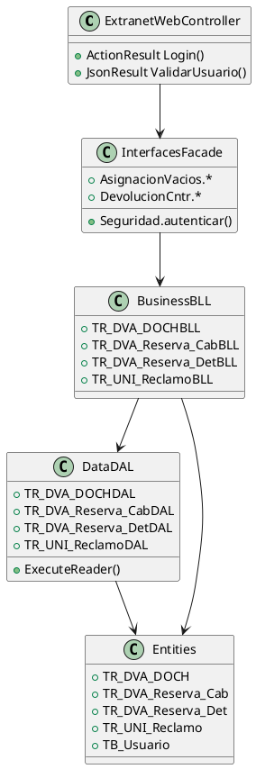
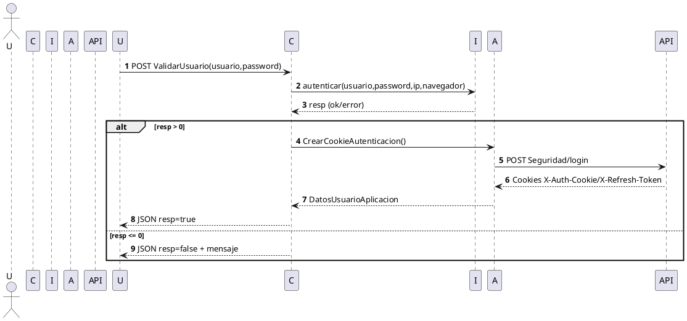
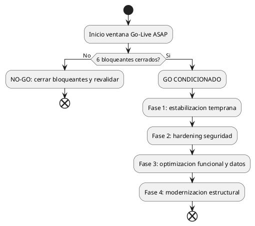
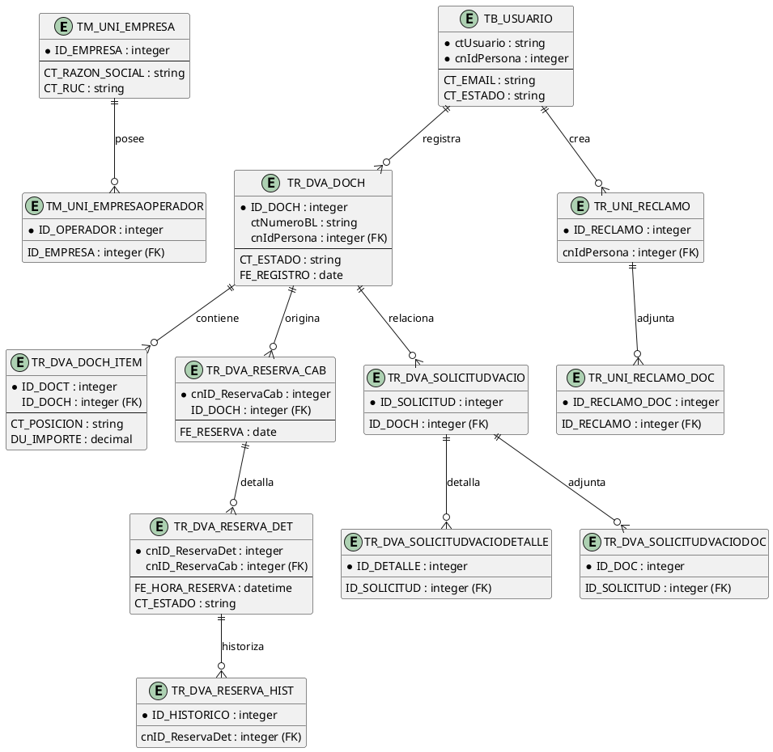
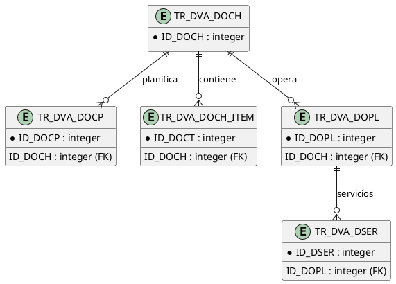
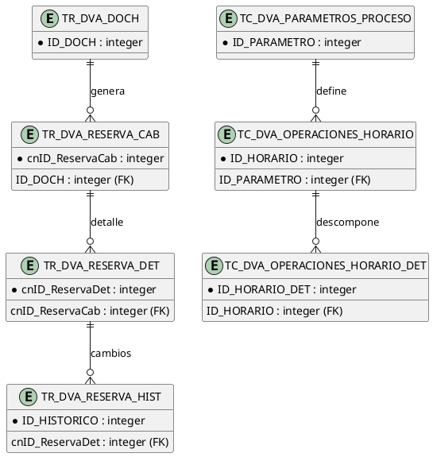
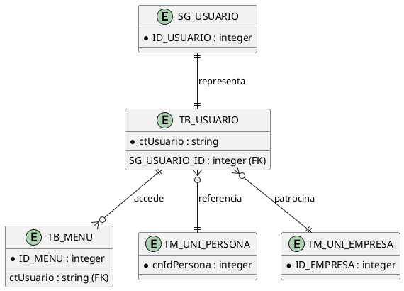
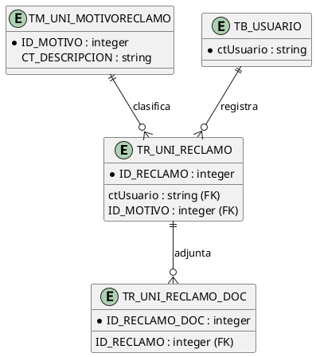
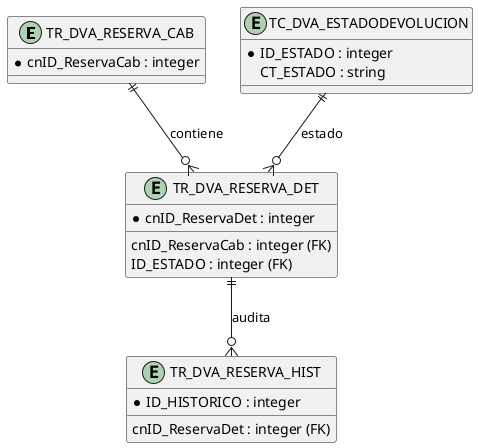
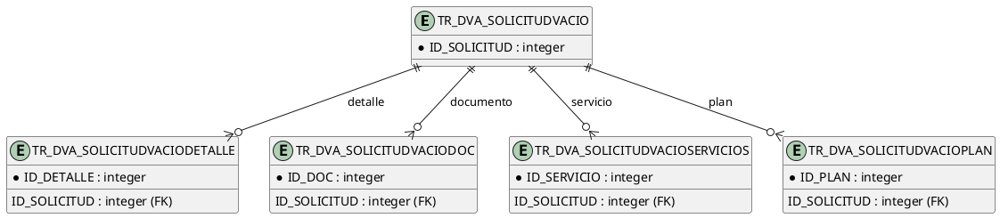

# Anexo de Diagramas - SIS_INTRANET (equivalente Extranet)

Nota: los modelos E/R y tablas son inferidos desde entidades y capas de codigo, al no encontrarse modelo fisico SQL oficial en el repositorio.

Navegacion:
- [Resumen ejecutivo e indice](resumen_ejecutivo_indice.md)
- [Informe tecnico principal](informe_tecnico.md)
- [Resumen visual ejecutivo](resumen_visual_ejecutivo.md)

## 1) UML - Class Diagram (vista simplificada por capas)



## 2) UML - Sequence Diagram (login y sesion)



## 3) UML - Flowchart (Go-Live ASAP condicionado)



## 4) C4 - Context

```plantuml
@startuml C4Context
!include https://raw.githubusercontent.com/plantuml-stdlib/C4-PlantUML/master/C4_Context.puml
title Contexto - SIS_INTRANET (Extranet)

Person(usuario, "Usuario Externo/Interno", "Opera reservas, documentos y reclamos")
System(sis, "SIS_INTRANET/Extranet", "Portal web MVC + Web API")
System_Ext(db, "SQL Server", "BD_EXTRANET / BD_INTRANET")
System_Ext(wcf, "Servicios WCF SAP/Internos", "Integraciones operativas")
System_Ext(api, "PortalWebApi", "Autenticacion y menu")

Rel(usuario, sis, "Usa", "HTTPS")
Rel(sis, db, "Consulta/actualiza", "T-SQL/SP")
Rel(sis, wcf, "Consume", "HTTP/HTTPS")
Rel(sis, api, "Autentica y consume menu", "HTTP/HTTPS")

@enduml
```

## 5) C4 - Container

```plantuml
@startuml C4Container
!include https://raw.githubusercontent.com/plantuml-stdlib/C4-PlantUML/master/C4_Container.puml
title Contenedores - SIS_INTRANET/Extranet

Person(usuario, "Usuario")
System_Boundary(s1, "Extranet") {
  Container(web, "ExtranetWeb", "ASP.NET MVC 4 + Web API 4", "UI y endpoints API")
  Container(interfaces, "Extranet.Interfaces", ".NET Class Library", "Fachadas de negocio")
  Container(bll, "Extranet.business", ".NET Class Library", "Reglas y orquestacion")
  Container(dal, "Extranet.data", ".NET Class Library", "Acceso a datos via SP")
  ContainerDb(db, "SQL Server", "BD_EXTRANET / BD_INTRANET", "Datos operativos")
}

Rel(usuario, web, "Navega/Opera", "HTTPS")
Rel(web, interfaces, "Invoca")
Rel(interfaces, bll, "Invoca")
Rel(bll, dal, "Invoca")
Rel(dal, db, "CRUD/SP", "T-SQL")

@enduml
```

## 6) Glosario de tablas principales (inferido)

| Tabla logica | Descripcion inferida |
|---|---|
| TR_DVA_DOCH | Cabecera documental operativa |
| TR_DVA_DOCH_ITEM | Detalle/posiciones asociadas a documento |
| TR_DVA_Reserva_Cab | Cabecera de reserva de cita/atencion |
| TR_DVA_Reserva_Det | Detalle de reserva por contenedor/slot |
| TR_DVA_Reserva_Hist | Historico de cambios de reserva |
| TR_DVA_SolicitudVacio | Solicitud principal de vacios |
| TR_DVA_SolicitudVacioDetalle | Detalle de solicitud de vacios |
| TR_DVA_SolicitudVacioDoc | Adjuntos/documentos de solicitud |
| TR_UNI_Reclamo | Reclamo principal |
| TR_UNI_Reclamo_Doc | Documentos de reclamo |
| TM_UNI_Empresa | Maestro de empresa |
| SG_Usuario / TB_Usuario | Seguridad/acceso de usuario |

## 7) Modelo E/R general (inferido)



## 8) E/R por dominio

### 8.1 Transmisiones



### 8.2 Operativo/Comercial



### 8.3 Seguridad/Acceso



### 8.4 Reclamos



### 8.5 Visitas/Reservas



### 8.6 Deposito Vacios



## 9) Diccionario de datos resumido (entidades clave, inferido)

| Entidad | Clave probable | Campos relevantes (observados por convencion) | Uso de negocio |
|---|---|---|---|
| TR_DVA_DOCH | ID_DOCH | ctNumeroBL, estados, usuario/terminal, fechas | Cabecera de proceso operativo |
| TR_DVA_DOCH_ITEM | ID_DOCT | importes, material, posicion, estado pago | Detalle transaccional y comisiones |
| TR_DVA_Reserva_Cab | cnID_ReservaCab | ID_DOCH, ctNumeroBL, fecha reserva, cliente | Reserva cabecera |
| TR_DVA_Reserva_Det | cnID_ReservaDet | fecha/hora reserva, tipo horario, contenedor, estado | Ejecucion de cita |
| TR_DVA_Reserva_Hist | (id historico) | fecha anterior/nueva, usuario, terminal, tipo horario | Auditoria de cambios |
| TR_DVA_SolicitudVacio | (id solicitud) | datos solicitud, operador, estado | Solicitud de vacios |
| TR_UNI_Reclamo | (id reclamo) | motivo, estado, usuario, fechas | Gestion de reclamos |
| TB_Usuario | cnIdPersona/ctUsuario | correo, tipo usuario, estado proceso | Identidad operativa |

## 10) Nota sobre visualización de diagramas

**Diagramas convertidos a PlantUML (gratuito y libre):**

Todos los diagramas en este documento utilizan la sintaxis **PlantUML**, que es:
- ✅ 100% gratuito y open-source
- ✅ Soportado en múltiples plataformas y herramientas
- ✅ Compatible con editores online

**Formas de visualizar los diagramas PlantUML:**

1. **Online (recomendado - sin instalación):**
   - [PlantUML Online Editor](https://www.plantuml.com/plantuml/uml/)
   - Copia y pega cualquier bloque `@startuml...@enduml` y presiona "Submit"

2. **En VS Code (extensión gratuita):**
   - Instala: "PlantUML" de jebbs
   - Abre archivo .md con diagrama y presiona Alt+D para preview

3. **Línea de comandos (Docker):**
   ```bash
   docker run --rm -v /ruta/al/archivo:/data plantuml /data/archivo.md
   ```

4. **GitHub (automático):**
   - Los bloques PlantUML se renderizan automáticamente en README.md y archivos .md de GitHub