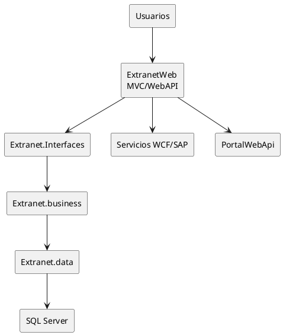
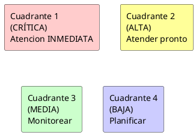
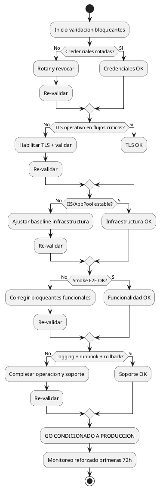

# Resumen Visual Ejecutivo (Mermaid)

## 1) Panorama de arquitectura



## 2) Mapa ejecutivo de riesgo

### Matriz de Riesgo (Impacto vs Urgencia)

| Riesgo | Impacto | Urgencia | Cuadrante | Acción |
|--------|---------|----------|-----------|--------|
| **Credenciales expuestas** | 0.95 | 0.96 | CRÍTICA (I) | ⚠️ Atencion INMEDIATA (P0, <48h) |
| **Endpoints HTTP críticos** | 0.90 | 0.92 | CRÍTICA (I) | ⚠️ Atencion INMEDIATA (P0, <48h) |
| **Debug en config base** | 0.72 | 0.80 | ALTA (II) | 🔴 Atender pronto (<1 semana) |
| **Cookies sin hardening completo** | 0.78 | 0.76 | ALTA (II) | 🔴 Atender pronto (<1 semana) |
| **Falta auth/csrf declarativo** | 0.82 | 0.84 | ALTA (II) | 🔴 Atender pronto (<1 semana) |
| **Deuda framework legacy** | 0.62 | 0.58 | MEDIA (III) | 🟡 Monitorear y planificar (Roadmap L/P) |

**Leyenda Cuadrantes:**
- **I (Alto impacto + Alta urgencia):** Atención inmediata - Bloqueantes de producción
- **II (Alto impacto + Baja urgencia / Bajo impacto + Alta urgencia):** Atender en próximas semanas
- **III (Bajo impacto + Baja urgencia):** Monitorear y planificar



**Ubicación en matriz (estimado):**
- Credenciales: Esquina superior derecha (Q1) - CRÍTICA
- Endpoints HTTP: Esquina superior derecha (Q1) - CRÍTICA
- Debug flag: Cuadrante superior izquierdo (Q2) - ALTA
- Cookie security: Cuadrante superior izquierdo (Q2) - ALTA
- Auth/CSRF: Cuadrante superior izquierdo (Q2) - ALTA
- Framework legacy: Centro/cuadrante inferior (Q3) - MEDIA/BAJA

## 3) Ruta de remediacion

```plantuml
@startuml
project Ruta de remediacion por fases

' Fase 0
[Fase 0: Bloqueantes criticos] starts 2026-04-29 and ends 2026-05-02
[Fase 0: Bloqueantes criticos] is colored in #FF6666

' Fase 1
[Fase 1: Estabilizacion temprana] starts 2026-05-02 and ends 2026-05-16
[Fase 1: Estabilizacion temprana] is colored in #FFCC66

' Fase 2
[Fase 2: Hardening de seguridad] starts 2026-05-16 and ends 2026-06-06
[Fase 2: Hardening de seguridad] is colored in #FFFF66

' Fase 3
[Fase 3: Optimizacion funcional] starts 2026-06-06 and ends 2026-07-06
[Fase 3: Optimizacion funcional] is colored in #66FF66

' Fase 4
[Fase 4: Modernizacion estructural] starts 2026-07-06 and ends 2026-08-31
[Fase 4: Modernizacion estructural] is colored in #66FFFF

@enduml
```

## 4) Ruta de salida a produccion ASAP


