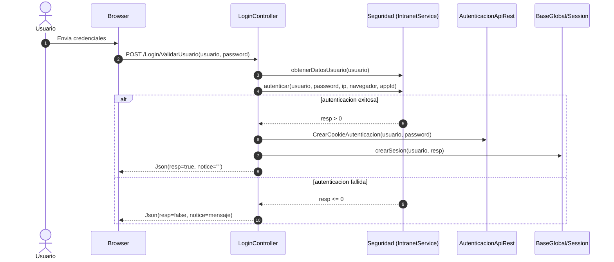
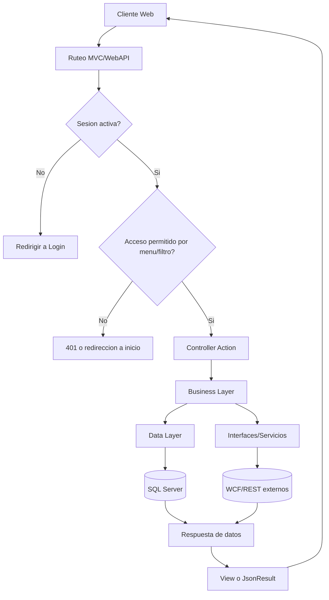
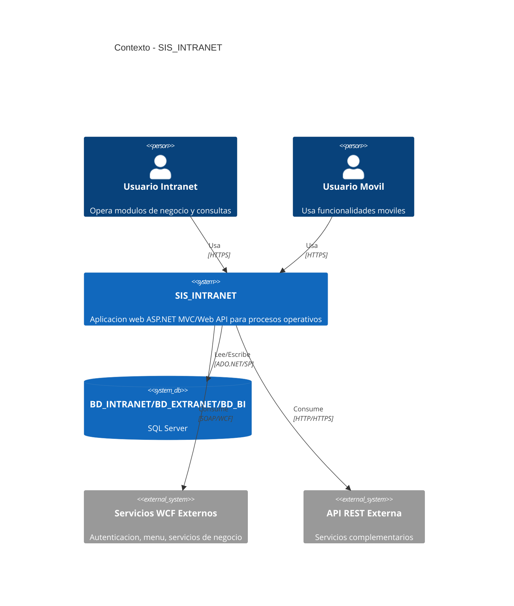
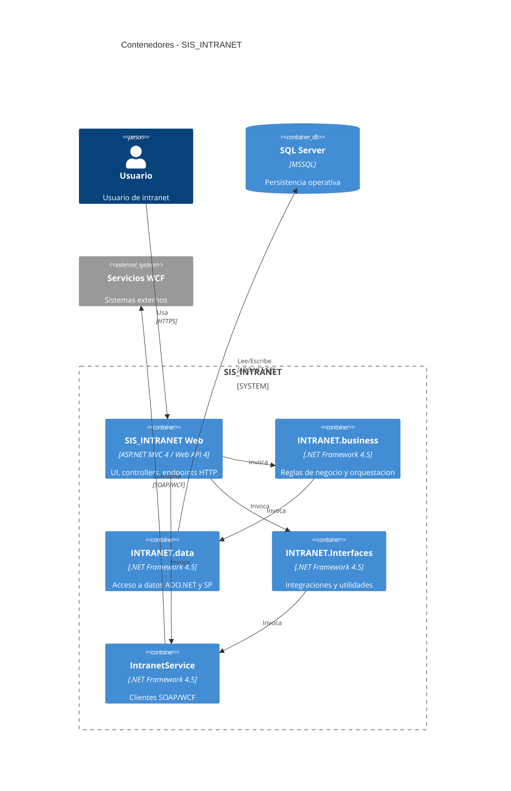

# Anexo de Diagramas de Arquitectura (PlantUML)

Documento relacionado al informe principal de auditoria:

- Ver resumen e indice: [RESUMEN_EJECUTIVO_E_INDICE.md](RESUMEN_EJECUTIVO_E_INDICE.md)
- Ver informe: [AUDITORIA_SOLUCION_SIS_INTRANET_2026-04-28.md](AUDITORIA_SOLUCION_SIS_INTRANET_2026-04-28.md)

## Indice

1. [Vista de capas y dependencias (UML - Class Diagram)](#1-vista-de-capas-y-dependencias-uml---class-diagram)
2. [Flujo de autenticacion web (UML - Sequence Diagram)](#2-flujo-de-autenticacion-web-uml---sequence-diagram)
3. [Flujo de solicitud HTTP en la aplicacion (UML - Flowchart)](#3-flujo-de-solicitud-http-en-la-aplicacion-uml---flowchart)
4. [C4 - Contexto del sistema](#4-c4---contexto-del-sistema)
5. [C4 - Contenedores principales](#5-c4---contenedores-principales)
6. [Glosario de tablas principales](#6-glosario-de-tablas-principales)
7. [Modelo E/R - Dominio de transmisiones](#7-modelo-er---dominio-de-transmisiones)
8. [Modelo E/R - Dominio operativo y comercial](#8-modelo-er---dominio-operativo-y-comercial)
9. [Modelo E/R - Dominio de seguridad y acceso](#9-modelo-er---dominio-de-seguridad-y-acceso)
10. [Modelo E/R - Dominio de reclamos](#10-modelo-er---dominio-de-reclamos)
11. [Modelo E/R - Dominio de visitas y reservas](#11-modelo-er---dominio-de-visitas-y-reservas)
12. [Modelo E/R - Dominio deposito vacios](#12-modelo-er---dominio-deposito-vacios)

## Indice visual del anexo

```plantuml
@startuml
skinparam backgroundColor #F5F5F5
skinparam defaultFontSize 10

rectangle "Anexo de Diagramas" as A #87CEEB
rectangle "Class Diagram" as U1 #B0E0E6
rectangle "Sequence Diagram" as U2 #B0E0E6
rectangle "Flowchart HTTP" as U3 #B0E0E6
rectangle "C4 Contexto" as C1 #B0E0E6
rectangle "C4 Contenedores" as C2 #B0E0E6
rectangle "Glosario" as G #D3D3D3
rectangle "ER Transmisiones" as E1 #DDA0DD
rectangle "ER Operativo" as E2 #DDA0DD
rectangle "ER Seguridad" as E3 #DDA0DD
rectangle "ER Reclamos" as E4 #DDA0DD
rectangle "ER Visitas" as E5 #DDA0DD
rectangle "ER DVA" as E6 #DDA0DD

A --> U1
A --> U2
A --> U3
A --> C1
A --> C2
A --> G
A --> E1
A --> E2
A --> E3
A --> E4
A --> E5
A --> E6
@enduml
## 1) Vista de capas y dependencias (UML - Class Diagram)

```mermaid
classDiagram
    class ClienteWeb {
      +Navegador
      +Usuario Final
    }

    class SIS_INTRANET_Web {
      +Controllers
      +Views
      +Apis
      +App_Start
    }

    class INTRANET_business {
      +Reglas de negocio
      +Orquestacion
    }

    class INTRANET_data {
      +Acceso a datos
      +Stored Procedures
    }

    class INTRANET_objects {
      +Entidades
      +DTOs
    }

    class INTRANET_Interfaces {
      +Integraciones
      +Control de accesos
      +Repositorio de envios
    }

    class IntranetService {
      +Proxy SOAP/WCF
      +Servicios externos
    }

    class SQL_Server {
      +BD_INTRANET
      +BD_EXTRANET
      +BD_BI
    }

    class WCF_Externos {
      +ws_extranet/wcf.svc
      +wcfAgencia.svc
    }

    ClienteWeb --> SIS_INTRANET_Web : HTTP(S)
    SIS_INTRANET_Web --> INTRANET_business : usa
    SIS_INTRANET_Web --> INTRANET_Interfaces : usa
    SIS_INTRANET_Web --> INTRANET_objects : usa
    SIS_INTRANET_Web --> IntranetService : usa

    INTRANET_business --> INTRANET_data : usa
    INTRANET_business --> INTRANET_objects : usa
    INTRANET_data --> INTRANET_objects : usa
    INTRANET_data --> SQL_Server : ADO.NET/SP

    INTRANET_Interfaces --> INTRANET_business : usa
    INTRANET_Interfaces --> IntranetService : usa
    IntranetService --> WCF_Externos : SOAP/WCF
```



## 2) Flujo de autenticacion web (UML - Sequence Diagram)



## 3) Flujo de solicitud HTTP en la aplicacion (UML - Flowchart)



## 4) C4 - Contexto del sistema



## 5) C4 - Contenedores principales



  ## 6) Glosario de tablas principales

  Nota: este glosario es inferido desde las clases de persistencia ubicadas en INTRANET.objects. No reemplaza un diccionario fisico oficial de base de datos, pero refleja las tablas mas relevantes observadas en el codigo.

  | Tabla | Modulo | Proposito funcional | PK principal | Relaciones relevantes |
  |---|---|---|---|---|
  | TR_UNI_Manifiesto | Intranet | Cabecera de manifiestos para transmisiones aduaneras/logisticas | cnID_Manifiesto | 1:N con TR_UNI_Transmision |
  | TR_UNI_Transmision | Intranet | Registro central de una transmision enviada/recibida | cnID_Transmision | N:1 con TR_UNI_Manifiesto; 1:N con DAM, contenedores y mensajes |
  | TR_UNI_Archivo | Intranet | Almacenamiento de archivo binario de envio/respuesta | cnID_Archivo | Referenciado por TR_UNI_Transmision y TR_UNI_Respuesta |
  | TR_UNI_Respuesta | Intranet | Resultado funcional de una transmision | cnID_Respuesta | N:1 con TR_UNI_Transmision; N:1 con TR_UNI_Archivo |
  | TR_UNI_ContenedorTransmision | Intranet | Contenedores asociados a una transmision | cnID_ContenedorTransmision | N:1 con TR_UNI_Transmision |
  | TR_UNI_PrecintoContenedor | Intranet | Precintos por contenedor transmitido | cnID_PrecintoContenedor | N:1 con TR_UNI_ContenedorTransmision |
  | TR_UNI_DAMTransmision | Intranet | DAMs vinculadas a una transmision | cnID_DAMTransmision | N:1 con TR_UNI_Transmision |
  | TR_UNI_DocumentoTransmision | Intranet | Documentos asociados a una DAM/transmision | cnID_DocumentoTransmision | N:1 con TR_UNI_DAMTransmision; N:1 con TR_UNI_Transmision |
  | TR_UNI_MensajeTransmision | Intranet | Mensajes/errores/advertencias producidos por la transmision | cnID_MensajeTransmision | N:1 con TR_UNI_Transmision |
  | TR_UNI_UsuariosSeg | Intranet | Datos de seguridad/usuarios de la aplicacion | no visible en lectura actual | Usada por autenticacion y permisos |
  | TM_UNI_Usuario | Intranet | Maestro de usuarios internos | no visible en lectura actual | Relacionable con areas/gerencias/centros |
  | TM_UNI_Area | Intranet | Maestro de areas organizacionales | no visible en lectura actual | Relacion organizacional |
  | TM_UNI_Gerencia | Intranet | Maestro de gerencias | no visible en lectura actual | Relacion organizacional |
  | TM_UNI_Centros | Intranet | Maestro de centros | no visible en lectura actual | Relacion organizacional |
  | TM_UNI_Persona | Extranet | Maestro de persona/visitante/actor del proceso | no visible en lectura actual | Asociada a reclamos, reservas y movimientos |
  | TM_UNI_Empresa | Extranet | Maestro de empresas/razon social | no visible en lectura actual | Asociada a personas y operaciones |
  | TR_UNI_Reclamo | Extranet | Cabecera de reclamos operativos/comerciales | no visible en lectura actual | 1:N con TR_UNI_Reclamo_Doc |
  | TR_UNI_Reclamo_Doc | Extranet | Adjuntos/documentos de reclamo | no visible en lectura actual | N:1 con TR_UNI_Reclamo |
  | TR_UNI_MovimientoCab | Extranet | Cabecera de movimiento logistico | no visible en lectura actual | 1:N con detalle y contenedores |
  | TR_UNI_MovimientoDet | Extranet | Detalle de movimiento logistico | no visible en lectura actual | N:1 con TR_UNI_MovimientoCab |
  | TR_UNI_MovimientoCnt | Extranet | Contenedores asociados a movimientos | no visible en lectura actual | N:1 con TR_UNI_MovimientoCab |
  | TR_DVA_Reserva_Cab | Extranet | Cabecera de reserva/cita de deposito vacios | no visible en lectura actual | 1:N con TR_DVA_Reserva_Det |
  | TR_DVA_Reserva_Det | Extranet | Detalle de reserva/cita | no visible en lectura actual | N:1 con TR_DVA_Reserva_Cab |
  | TR_DVA_DOCH | Extranet | Documento/cabecera operativa del dominio deposito vacios | no visible en lectura actual | 1:N con TR_DVA_DOCH_ITEM |
  | TR_DVA_DOCH_ITEM | Extranet | Items asociados al documento operativo | no visible en lectura actual | N:1 con TR_DVA_DOCH |
  | TC_DVA_Parametro | Extranet | Parametros funcionales/configuracion del dominio DVA | no visible en lectura actual | Usada por reglas y procesos |
  | TC_UNI_Mensajes | Extranet | Catalogo de mensajes del sistema | no visible en lectura actual | Consumida por reglas de negocio/UI |

  ### 6.1 Diccionario de datos resumido por entidades clave

  | Tabla | Campos clave observados | Interpretacion funcional |
  |---|---|---|
  | TR_UNI_Manifiesto | cnID_Manifiesto, cnViaTransporte, ctCodigoAduana, ctAnhoManifiesto, ctNroManifiesto, ctNave | Identifica el manifiesto logistico/aduanero que agrupa transmisiones |
  | TR_UNI_Transmision | cnID_Transmision, cnID_Manifiesto, ctCorrelativo, ctDocumentoTransporte, ctSerieVIN, cnCodigoEstado, cnID_ArchivoEnvio, cnID_ArchivoRespuesta | Registro central del envio procesado por la plataforma |
  | TR_UNI_Archivo | cnID_Archivo, cdFechaHoraEnvio, ctTipoArchivo, cbComprimido, ctNombreArchivo, coData | Binario asociado a envio o respuesta |
  | TR_UNI_Respuesta | cnID_Respuesta, cnID_Transmision, cdFechaHoraRespuesta, cnCodigoEstado, cnCantidadErrores, cnCantidadAdvertencias, cnCantidadMensajes | Resultado de recepcion/validacion de una transmision |
  | TR_UNI_ContenedorTransmision | cnID_ContenedorTransmision, cnID_Transmision, ctNumero, ctTipo, ctTamano, cnTara, cnPayload | Contenedor declarado dentro de una transmision |
  | TR_UNI_PrecintoContenedor | cnID_PrecintoContenedor, cnID_ContenedorTransmision, ctTipo, ctNumero, ctCondicion | Precinto asociado al contenedor transmitido |
  | TR_UNI_DAMTransmision | cnID_DAMTransmision, cnID_Transmision, ctNumeroDAM, ctCodigoOperacion, ctNroDocumentoDespachador | Declaracion DAM relacionada con la transmision |
  | TR_UNI_DocumentoTransmision | cnID_DocumentoTransmision, cnID_DAMTransmision, cnID_Transmision, ctDocumentoTransporte, cbLigado | Documento vinculado a DAM/transmision |
  | TR_UNI_MensajeTransmision | cnID_MensajeTransmision, cnID_Transmision, ctTipo, ctCodigo, ctMensaje | Error, advertencia o mensaje funcional |
  | TR_UNI_UsuariosSeg | id_Emple, ID_TipDoc, ctNroDoc, cnID_Visitante, Nombre, ID_Area, ID_Gerencia, cbEstadoHabilitado, cbBloqueado | Identidad operativa para control de acceso y datos de seguridad |
  | TC_UNI_Visitante | cnID_Visitante, ctTipoVisitante, cbEstado | Catalogo/tipo de visitante en el dominio de accesos/visitas |
  | TR_UNI_Reclamo | cnID_ReclamoCab, cnID_Sector, ctClienteRUC, ctNombrePersonaContacto, ctEmail, ctResponsableReclamo, ctDescripcionReclamo, ctEstadoReclamo, cnID_MotivoReclamo, cbProcede | Cabecera del reclamo y su trazabilidad de atencion |
  | TR_DVA_Reserva_Cab | cnID_ReservaCab, ctNumeroBL, cdFechaReserva, ctRUCCliente, ID_DOCH, ctNombreCliente, cnID_Visitante, cnEstadoSolicitud | Cabecera de reserva/cita del dominio deposito vacios |

  ### 6.2 Cobertura del glosario

  - El repositorio contiene un universo de entidades mucho mayor al resumido aqui.
  - Este glosario prioriza las tablas con mayor valor arquitectonico para auditoria.
  - Para un diccionario de datos completo seria necesario contrastar con scripts SQL, metadata del servidor o catalogo real de BD.

  ## 7) Modelo E/R - Dominio de transmisiones

  ```mermaid
  erDiagram
    TR_UNI_MANIFIESTO ||--o{ TR_UNI_TRANSMISION : agrupa
    TR_UNI_ARCHIVO ||--o{ TR_UNI_TRANSMISION : archivo_envio
    TR_UNI_ARCHIVO ||--o{ TR_UNI_RESPUESTA : archivo_respuesta
    TR_UNI_TRANSMISION ||--o| TR_UNI_RESPUESTA : genera
    TR_UNI_TRANSMISION ||--o{ TR_UNI_CONTENEDOR_TRANSMISION : contiene
    TR_UNI_CONTENEDOR_TRANSMISION ||--o{ TR_UNI_PRECINTO_CONTENEDOR : registra
    TR_UNI_TRANSMISION ||--o{ TR_UNI_DAM_TRANSMISION : declara
    TR_UNI_DAM_TRANSMISION ||--o{ TR_UNI_DOCUMENTO_TRANSMISION : referencia
    TR_UNI_TRANSMISION ||--o{ TR_UNI_MENSAJE_TRANSMISION : produce

    TR_UNI_MANIFIESTO {
      int cnID_Manifiesto PK
      int cnViaTransporte
      string ctCodigoAduana
      string ctAnhoManifiesto
      string ctNroManifiesto
      string ctNave
    }

    TR_UNI_TRANSMISION {
      int cnID_Transmision PK
      int cnID_Manifiesto FK
      int cnID_Respuesta FK
      int cnID_ArchivoEnvio FK
      int cnID_ArchivoRespuesta FK
      string ctCorrelativo
      string ctDocumentoTransporte
      string ctSerieVIN
      int cnCodigoEstado
    }

    TR_UNI_ARCHIVO {
      int cnID_Archivo PK
      datetime cdFechaHoraEnvio
      string ctTipoArchivo
      string ctNombreArchivo
      bool cbComprimido
      binary coData
    }

    TR_UNI_RESPUESTA {
      int cnID_Respuesta PK
      int cnID_Transmision FK
      int cnID_ArchivoRespuesta FK
      datetime cdFechaHoraRespuesta
      int cnCodigoEstado
      int cnCantidadErrores
      int cnCantidadAdvertencias
      int cnCantidadMensajes
    }

    TR_UNI_CONTENEDOR_TRANSMISION {
      int cnID_ContenedorTransmision PK
      int cnID_Transmision FK
      string ctNumero
      string ctTipo
      string ctTamano
      decimal cnTara
      decimal cnPayload
    }

    TR_UNI_PRECINTO_CONTENEDOR {
      int cnID_PrecintoContenedor PK
      int cnID_ContenedorTransmision FK
      string ctTipo
      string ctNumero
      string ctCondicion
    }

    TR_UNI_DAM_TRANSMISION {
      int cnID_DAMTransmision PK
      int cnID_Transmision FK
      string ctNumeroDAM
      string ctCodigoOperacion
      string ctNroDocumentoDespachador
    }

    TR_UNI_DOCUMENTO_TRANSMISION {
      int cnID_DocumentoTransmision PK
      int cnID_DAMTransmision FK
      int cnID_Transmision FK
      string ctDocumentoTransporte
      bool cbLigado
    }

    TR_UNI_MENSAJE_TRANSMISION {
      int cnID_MensajeTransmision PK
      int cnID_Transmision FK
      string ctTipo
      string ctCodigo
      string ctMensaje
    }
  ```

  ## 8) Modelo E/R - Dominio operativo y comercial

  ```mermaid
  erDiagram
    TM_UNI_EMPRESA ||--o{ TM_UNI_PERSONA : agrupa
    TM_UNI_PERSONA ||--o{ TR_UNI_RECLAMO : registra
    TR_UNI_RECLAMO ||--o{ TR_UNI_RECLAMO_DOC : adjunta
    TR_UNI_MOVIMIENTO_CAB ||--o{ TR_UNI_MOVIMIENTO_DET : detalla
    TR_UNI_MOVIMIENTO_CAB ||--o{ TR_UNI_MOVIMIENTO_CNT : contiene
    TR_DVA_RESERVA_CAB ||--o{ TR_DVA_RESERVA_DET : detalla
    TR_DVA_DOCH ||--o{ TR_DVA_DOCH_ITEM : contiene
    TC_DVA_PARAMETRO ||--o{ TR_DVA_DOCH : parametriza

    TM_UNI_EMPRESA {
      int id PK
      string razonSocial
      string ruc
    }

    TM_UNI_PERSONA {
      int id PK
      int empresaId FK
      string nombres
      string apellidoPaterno
      string apellidoMaterno
      string documento
    }

    TR_UNI_RECLAMO {
      int id PK
      int personaId FK
      datetime fechaRegistro
      string estado
      string descripcion
    }

    TR_UNI_RECLAMO_DOC {
      int id PK
      int reclamoId FK
      string rutaAdjunto
      string nombreArchivo
    }

    TR_UNI_MOVIMIENTO_CAB {
      int id PK
      datetime fechaMovimiento
      string estado
      string tipoOperacion
    }

    TR_UNI_MOVIMIENTO_DET {
      int id PK
      int movimientoCabId FK
      string descripcion
      int cantidad
    }

    TR_UNI_MOVIMIENTO_CNT {
      int id PK
      int movimientoCabId FK
      string numeroContenedor
      string tipoContenedor
    }

    TR_DVA_RESERVA_CAB {
      int id PK
      datetime fechaReserva
      string estado
      string codigoReserva
    }

    TR_DVA_RESERVA_DET {
      int id PK
      int reservaCabId FK
      string servicio
      int cantidad
    }

    TR_DVA_DOCH {
      int id PK
      string numeroDocumento
      datetime fechaDocumento
      string estado
    }

    TR_DVA_DOCH_ITEM {
      int id PK
      int dochId FK
      string item
      int cantidad
    }

    TC_DVA_PARAMETRO {
      int id PK
      string clave
      string valor
      bool estado
    }
  ```

  ## 9) Modelo E/R - Dominio de seguridad y acceso

  ```mermaid
  erDiagram
    TC_UNI_VISITANTE ||--o{ TR_UNI_USUARIOSSEG : clasifica
    TR_UNI_USUARIOSSEG }o--|| TM_UNI_AREA : pertenece
    TR_UNI_USUARIOSSEG }o--|| TM_UNI_GERENCIA : depende
    TR_UNI_USUARIOSSEG }o--o| TM_UNI_USUARIO : mapea
    TM_UNI_GERENCIA ||--o{ TM_UNI_AREA : organiza

    TC_UNI_VISITANTE {
      int cnID_Visitante PK
      string ctTipoVisitante
      bool cbEstado
    }

    TR_UNI_USUARIOSSEG {
      int id_Emple PK
      int ID_TipDoc
      string ctNroDoc
      int cnID_Visitante FK
      string Nombre
      int ID_Area FK
      int ID_Gerencia FK
      bool cbEstadoHabilitado
      bool cbBloqueado
    }

    TM_UNI_USUARIO {
      int ID_Usuario PK
      string Usuario
      bool Estado
    }

    TM_UNI_AREA {
      int ID_Area PK
      string ctArea
    }

    TM_UNI_GERENCIA {
      int ID_Gerencia PK
      string ctGerencia
    }
  ```

  ## 10) Modelo E/R - Dominio de reclamos

  ```mermaid
  erDiagram
    TM_UNI_EMPRESA ||--o{ TR_UNI_RECLAMO : reporta
    TM_UNI_PERSONA ||--o{ TR_UNI_RECLAMO : contacta
    TR_UNI_RECLAMO }o--|| TM_UNI_MOTIVO_RECLAMO : clasifica
    TR_UNI_RECLAMO }o--o| TC_UNI_RESPONSABLE_RECLAMO : asigna
    TR_UNI_RECLAMO ||--o{ TR_UNI_RECLAMO_DOC : adjunta

    TM_UNI_EMPRESA {
      int id PK
      string ruc
      string razonSocial
    }

    TM_UNI_PERSONA {
      int id PK
      string nombres
      string apellidos
      string email
      string telefono
    }

    TM_UNI_MOTIVO_RECLAMO {
      int cnID_MotivoReclamo PK
      string descripcion
    }

    TC_UNI_RESPONSABLE_RECLAMO {
      int id PK
      string responsable
    }

    TR_UNI_RECLAMO {
      int cnID_ReclamoCab PK
      string ctClienteRUC
      int cnID_MotivoReclamo FK
      string ctResponsableReclamo
      string ctDocumentoReferencia
      string ctDescripcionReclamo
      string ctEstadoReclamo
      bool cbProcede
    }

    TR_UNI_RECLAMO_DOC {
      int id PK
      int reclamoId FK
      string rutaAdjunto
      string nombreArchivo
    }
  ```

  ## 11) Modelo E/R - Dominio de visitas y reservas

  ```mermaid
  erDiagram
    TC_UNI_VISITANTE ||--o{ TR_DVA_RESERVA_CAB : tipifica
    TR_DVA_RESERVA_CAB }o--o| TM_UNI_PERSONA : solicita
    TR_DVA_RESERVA_CAB }o--o| TR_DVA_DOCH : referencia
    TR_DVA_RESERVA_CAB ||--o{ TR_DVA_RESERVA_DET : detalla

    TC_UNI_VISITANTE {
      int cnID_Visitante PK
      string ctTipoVisitante
      bool cbEstado
    }

    TM_UNI_PERSONA {
      int id PK
      string nombres
      string documento
    }

    TR_DVA_DOCH {
      int ID_DOCH PK
      string numeroDocumento
      string estado
    }

    TR_DVA_RESERVA_CAB {
      int cnID_ReservaCab PK
      string ctNumeroBL
      date cdFechaReserva
      int ID_DOCH FK
      string ctRUCCliente
      string ctNombreCliente
      int cnID_Visitante FK
      int cnEstadoSolicitud
    }

    TR_DVA_RESERVA_DET {
      int id PK
      int cnID_ReservaCab FK
      string servicio
      int cantidad
    }
  ```

  ## 12) Modelo E/R - Dominio deposito vacios

  ```mermaid
  erDiagram
    TR_DVA_DOCH ||--o{ TR_DVA_DOCH_ITEM : contiene
    TC_DVA_PARAMETRO ||--o{ TR_DVA_DOCH : parametriza
    TC_DVA_DEVOLUCION_HORAS_SERVICIO ||--o{ TR_DVA_DOCH : condiciona
    TC_DVA_CENTRO_PUERTO ||--o{ TR_DVA_DOCH : ubica
    TR_DVA_DOCH ||--o{ TR_DVA_INGRESO_ASIGNACION : asigna
    TR_DVA_DOCH ||--o{ TR_DVA_INGRESO_DEVOLUCION : devuelve

    TR_DVA_DOCH {
      int ID_DOCH PK
      string numeroDocumento
      date fechaDocumento
      string estado
    }

    TR_DVA_DOCH_ITEM {
      int id PK
      int ID_DOCH FK
      string item
      int cantidad
    }

    TC_DVA_PARAMETRO {
      int id PK
      string clave
      string valor
    }

    TC_DVA_DEVOLUCION_HORAS_SERVICIO {
      int id PK
      string rangoHorario
      bool estado
    }

    TC_DVA_CENTRO_PUERTO {
      int id PK
      string centro
      string puerto
    }

    TR_DVA_INGRESO_ASIGNACION {
      int id PK
      int ID_DOCH FK
      string estado
    }

    TR_DVA_INGRESO_DEVOLUCION {
      int id PK
      int ID_DOCH FK
      string estado
    }
  ```
