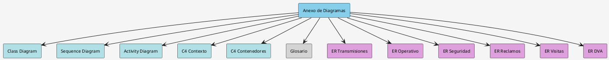
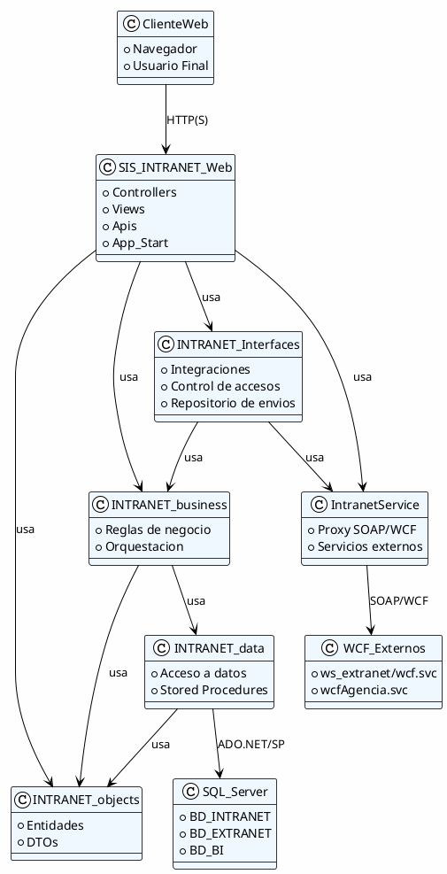
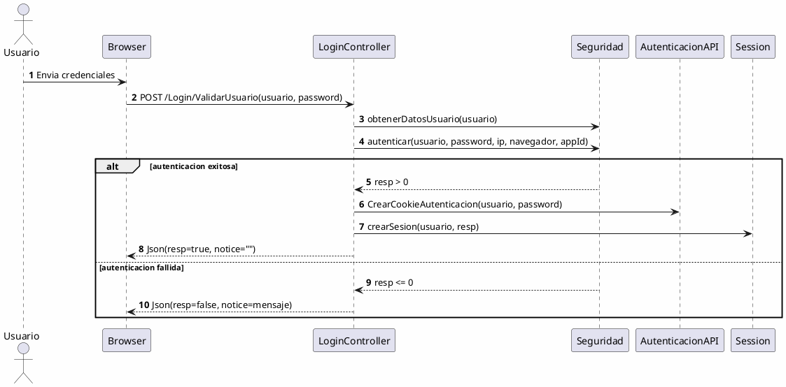
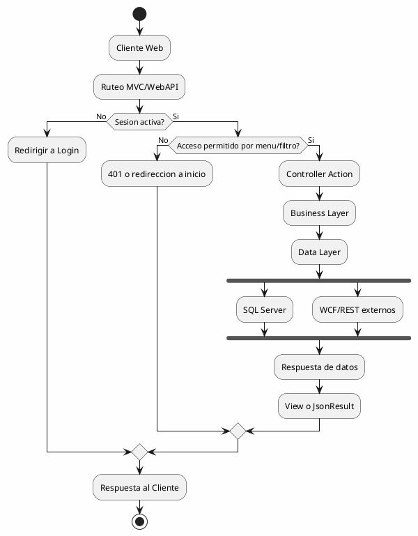
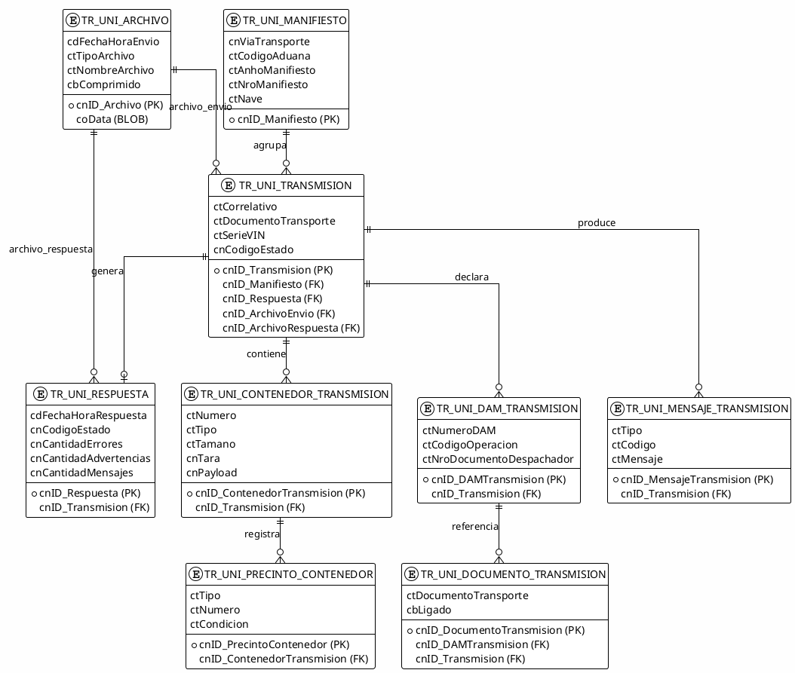
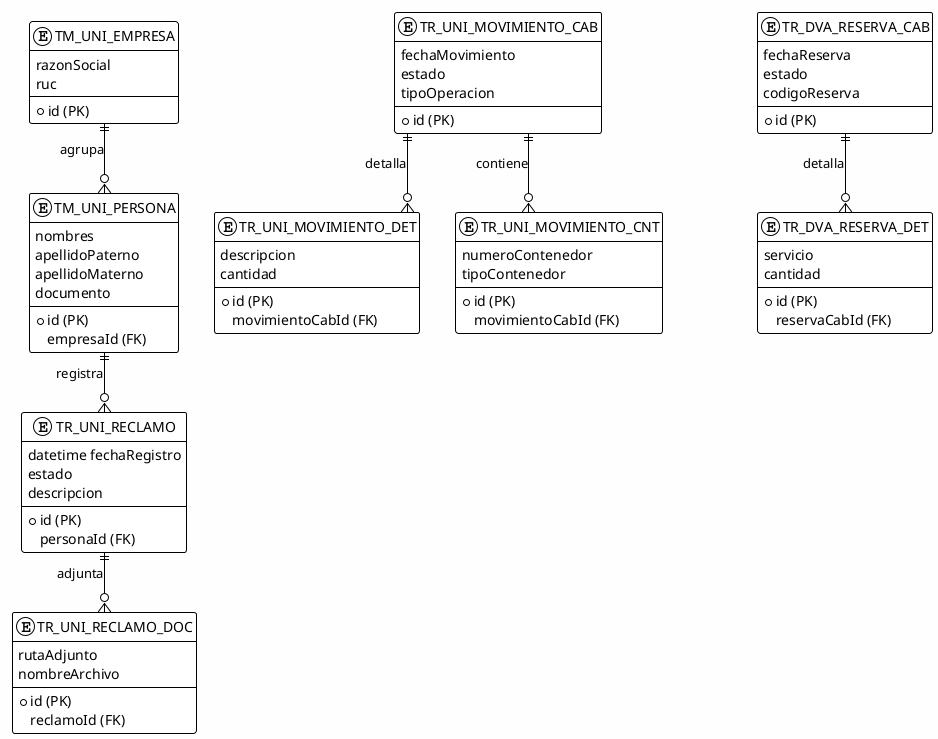
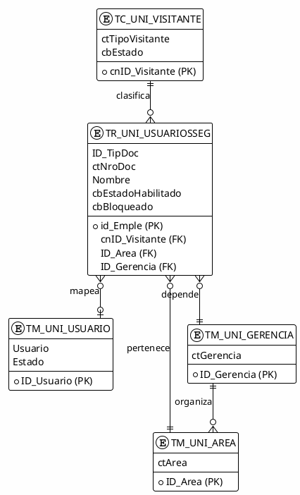
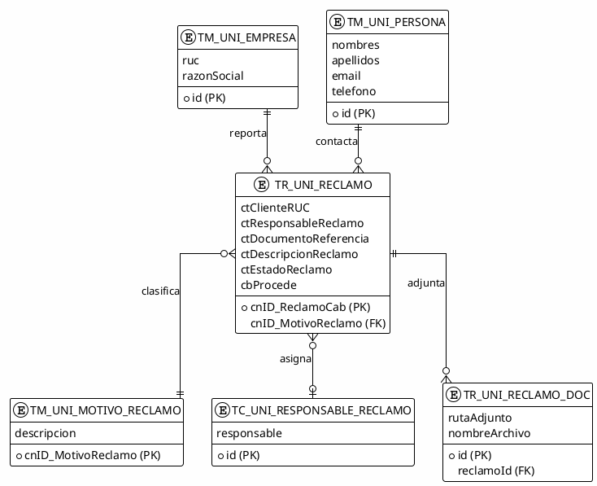
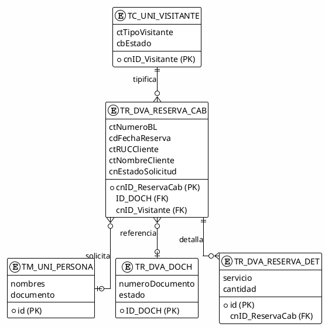
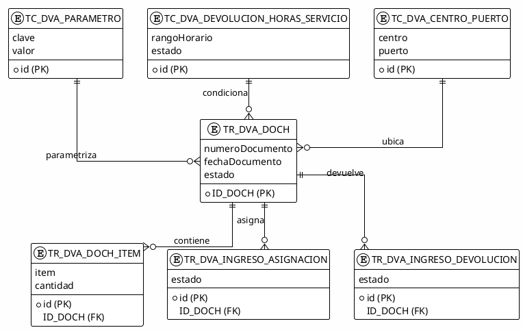

# Anexo de Diagramas de Arquitectura (PlantUML)

Documento relacionado al informe principal de auditoria:

- Ver resumen e indice: [RESUMEN_EJECUTIVO_E_INDICE.md](RESUMEN_EJECUTIVO_E_INDICE.md)
- Ver informe: [AUDITORIA_SOLUCION_SIS_INTRANET_2026-04-28.md](AUDITORIA_SOLUCION_SIS_INTRANET_2026-04-28.md)
- Ver resumen visual: [RESUMEN_VISUAL_EJECUTIVO_PLANTUML.md](RESUMEN_VISUAL_EJECUTIVO_PLANTUML.md)

**Nota sobre PlantUML:** Todos los diagramas están en formato PlantUML (gratuito y de código abierto).
- Visualización en VS Code: instala la extensión "PlantUML" (gratuita)
- Editor online: http://www.plantuml.com/plantuml/uml/
- Generación de imágenes: `plantuml -o output diagram.md`

## Indice

1. [Vista de capas y dependencias (UML - Class Diagram)](#1-vista-de-capas-y-dependencias-uml---class-diagram)
2. [Flujo de autenticacion web (UML - Sequence Diagram)](#2-flujo-de-autenticacion-web-uml---sequence-diagram)
3. [Flujo de solicitud HTTP en la aplicacion (UML - Activity Diagram)](#3-flujo-de-solicitud-http-en-la-aplicacion-uml---activity-diagram)
4. [C4 - Contexto del sistema](#4-c4---contexto-del-sistema)
5. [C4 - Contenedores principales](#5-c4---contenedores-principales)
6. [Glosario de tablas principales](#6-glosario-de-tablas-principales)
7. [Modelo E/R - Dominio de transmisiones](#7-modelo-er---dominio-de-transmisiones)
8. [Modelo E/R - Dominio operativo y comercial](#8-modelo-er---dominio-operativo-y-comercial)
9. [Modelo E/R - Dominio de seguridad y acceso](#9-modelo-er---dominio-de-seguridad-y-acceso)
10. [Modelo E/R - Dominio de reclamos](#10-modelo-er---dominio-de-reclamos)
11. [Modelo E/R - Dominio de visitas y reservas](#11-modelo-er---dominio-de-visitas-y-reservas)
12. [Modelo E/R - Dominio deposito vacios](#12-modelo-er---dominio-deposito-vacios)

## Indice visual del anexo



## 1) Vista de capas y dependencias (UML - Class Diagram)



## 2) Flujo de autenticacion web (UML - Sequence Diagram)



## 3) Flujo de solicitud HTTP en la aplicacion (UML - Activity Diagram)



## 4) C4 - Contexto del sistema

```plantuml
@startuml
!include https://raw.githubusercontent.com/plantuml-stdlib/C4-PlantUML/master/C4_Context.puml

SHOW_PERSON_OUTLINE()

Person(usuario, "Usuario Intranet", "Opera modulos de negocio y consultas")
Person(movil, "Usuario Movil", "Usa funcionalidades moviles")

System(sis, "SIS_INTRANET", "Aplicacion web ASP.NET MVC/Web API para procesos operativos")

System_Ext(bd, "BD_INTRANET/BD_EXTRANET/BD_BI", "SQL Server - Persistencia")
System_Ext(wsSeg, "Servicios WCF Externos", "Autenticacion, menu, servicios de negocio")
System_Ext(apiRest, "API REST Externa", "Servicios complementarios")

Rel(usuario, sis, "Usa", "HTTPS")
Rel(movil, sis, "Usa", "HTTPS")
Rel(sis, bd, "Lee/Escribe", "ADO.NET/SP")
Rel(sis, wsSeg, "Consume", "SOAP/WCF")
Rel(sis, apiRest, "Consume", "HTTP/HTTPS")

SHOW_LEGEND()
@enduml
```

## 5) C4 - Contenedores principales

```plantuml
@startuml
!include https://raw.githubusercontent.com/plantuml-stdlib/C4-PlantUML/master/C4_Container.puml

SHOW_PERSON_OUTLINE()

Person(usuario, "Usuario", "Usuario de intranet")

System_Boundary(c1, "SIS_INTRANET") {
  Container(web, "SIS_INTRANET Web", "ASP.NET MVC 4 / Web API 4", "UI, controllers, endpoints HTTP")
  Container(bll, "INTRANET.business", ".NET Framework 4.5", "Reglas de negocio y orquestacion")
  Container(dal, "INTRANET.data", ".NET Framework 4.5", "Acceso a datos ADO.NET y SP")
  Container(intf, "INTRANET.Interfaces", ".NET Framework 4.5", "Integraciones y utilidades")
  Container(svc, "IntranetService", ".NET Framework 4.5", "Clientes SOAP/WCF")
}

ContainerDb(sql, "SQL Server", "MSSQL", "Persistencia operativa")
System_Ext(wcf, "Servicios WCF", "Sistemas externos")

Rel(usuario, web, "Usa", "HTTPS")
Rel(web, bll, "Invoca")
Rel(web, intf, "Invoca")
Rel(web, svc, "Invoca")
Rel(bll, dal, "Invoca")
Rel(dal, sql, "Lee/Escribe", "ADO.NET/SP")
Rel(intf, svc, "Invoca")
Rel(svc, wcf, "Consume", "SOAP/WCF")

SHOW_LEGEND()
@enduml
```

## 6) Glosario de tablas principales

Nota: este glosario es inferido desde las clases de persistencia ubicadas en INTRANET.objects. No reemplaza un diccionario fisico oficial de base de datos, pero refleja las tablas mas relevantes observadas en el codigo.

| Tabla | Modulo | Proposito funcional | PK principal | Relaciones relevantes |
|---|---|---|---|---|
| TR_UNI_Manifiesto | Intranet | Cabecera de manifiestos para transmisiones aduaneras/logisticas | cnID_Manifiesto | 1:N con TR_UNI_Transmision |
| TR_UNI_Transmision | Intranet | Registro central de una transmision enviada/recibida | cnID_Transmision | N:1 con TR_UNI_Manifiesto; 1:N con DAM, contenedores y mensajes |
| TR_UNI_Archivo | Intranet | Almacenamiento de archivo binario de envio/respuesta | cnID_Archivo | Referenciado por TR_UNI_Transmision y TR_UNI_Respuesta |
| TR_UNI_Respuesta | Intranet | Resultado funcional de una transmision | cnID_Respuesta | N:1 con TR_UNI_Transmision; N:1 con TR_UNI_Archivo |
| TR_UNI_ContenedorTransmision | Intranet | Contenedores asociados a una transmision | cnID_ContenedorTransmision | N:1 con TR_UNI_Transmision |
| TR_UNI_PrecintoContenedor | Intranet | Precintos por contenedor transmitido | cnID_PrecintoContenedor | N:1 con TR_UNI_ContenedorTransmision |
| TR_UNI_DAMTransmision | Intranet | DAMs vinculadas a una transmision | cnID_DAMTransmision | N:1 con TR_UNI_Transmision |
| TR_UNI_DocumentoTransmision | Intranet | Documentos asociados a una DAM/transmision | cnID_DocumentoTransmision | N:1 con TR_UNI_DAMTransmision; N:1 con TR_UNI_Transmision |
| TR_UNI_MensajeTransmision | Intranet | Mensajes/errores/advertencias producidos por la transmision | cnID_MensajeTransmision | N:1 con TR_UNI_Transmision |
| TR_UNI_UsuariosSeg | Intranet | Datos de seguridad/usuarios de la aplicacion | no visible en lectura actual | Usada por autenticacion y permisos |
| TM_UNI_Usuario | Intranet | Maestro de usuarios internos | no visible en lectura actual | Relacionable con areas/gerencias/centros |
| TM_UNI_Area | Intranet | Maestro de areas organizacionales | no visible en lectura actual | Relacion organizacional |
| TM_UNI_Gerencia | Intranet | Maestro de gerencias | no visible en lectura actual | Relacion organizacional |
| TM_UNI_Centros | Intranet | Maestro de centros | no visible en lectura actual | Relacion organizacional |
| TM_UNI_Persona | Extranet | Maestro de persona/visitante/actor del proceso | no visible en lectura actual | Asociada a reclamos, reservas y movimientos |
| TM_UNI_Empresa | Extranet | Maestro de empresas/razon social | no visible en lectura actual | Asociada a personas y operaciones |
| TR_UNI_Reclamo | Extranet | Cabecera de reclamos operativos/comerciales | no visible en lectura actual | 1:N con TR_UNI_Reclamo_Doc |
| TR_UNI_Reclamo_Doc | Extranet | Adjuntos/documentos de reclamo | no visible en lectura actual | N:1 con TR_UNI_Reclamo |
| TR_UNI_MovimientoCab | Extranet | Cabecera de movimiento logistico | no visible en lectura actual | 1:N con detalle y contenedores |
| TR_UNI_MovimientoDet | Extranet | Detalle de movimiento logistico | no visible en lectura actual | N:1 con TR_UNI_MovimientoCab |
| TR_UNI_MovimientoCnt | Extranet | Contenedores asociados a movimientos | no visible en lectura actual | N:1 con TR_UNI_MovimientoCab |
| TR_DVA_Reserva_Cab | Extranet | Cabecera de reserva/cita de deposito vacios | no visible en lectura actual | 1:N con TR_DVA_Reserva_Det |
| TR_DVA_Reserva_Det | Extranet | Detalle de reserva/cita | no visible en lectura actual | N:1 con TR_DVA_Reserva_Cab |

## 7) Modelo E/R - Dominio de transmisiones



## 8) Modelo E/R - Dominio operativo y comercial



## 9) Modelo E/R - Dominio de seguridad y acceso



## 10) Modelo E/R - Dominio de reclamos



## 11) Modelo E/R - Dominio de visitas y reservas



## 12) Modelo E/R - Dominio deposito vacios


