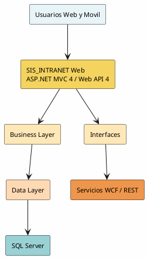
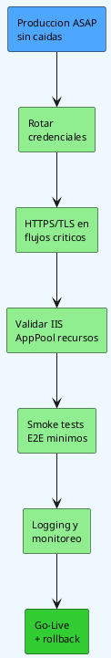
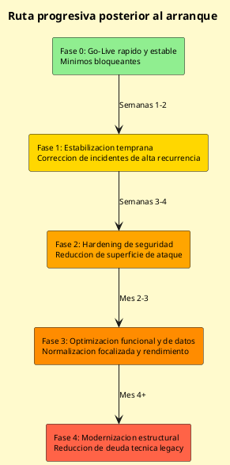

# Resumen Visual Ejecutivo (PlantUML)

Documento relacionado:

- Ver resumen e indice: [RESUMEN_EJECUTIVO_E_INDICE.md](RESUMEN_EJECUTIVO_E_INDICE.md)
- Ver informe tecnico: [AUDITORIA_SOLUCION_SIS_INTRANET_2026-04-28.md](AUDITORIA_SOLUCION_SIS_INTRANET_2026-04-28.md)
- Ver anexo de arquitectura: [ANEXO_DIAGRAMAS_ARQUITECTURA_PLANTUML.md](ANEXO_DIAGRAMAS_ARQUITECTURA_PLANTUML.md)

**Nota:** PlantUML es una alternativa libre y de código abierto a Mermaid. Puedes visualizar los diagramas usando:
- Extensión PlantUML para VS Code (gratuita)
- PlantUML Online: http://www.plantuml.com/plantuml/uml/
- Generar PNG/SVG via CLI: `plantuml diagram.md`

## Indice visual

1. [Panorama de arquitectura](#1-panorama-de-arquitectura)
2. [Mapa ejecutivo de riesgo](#2-mapa-ejecutivo-de-riesgo)
3. [Ruta de salida a produccion ASAP](#3-ruta-de-salida-a-produccion-asap)
4. [Plan progresivo de optimizacion](#4-plan-progresivo-de-optimizacion)

## 1) Panorama de arquitectura



## 2) Mapa ejecutivo de riesgo

```plantuml
@startuml
skinparam backgroundColor #FFF5F5
skinparam defaultFontSize 11

rectangle "Riesgo global: Alto-Critico" as R0 #FF6B6B
rectangle "Seguridad\nCredenciales y TLS" as R1 #FFB3B3
rectangle "Continuidad\nEstabilidad operativa" as R2 #FFB3B3
rectangle "Arquitectura\nMonolito legacy" as R3 #FFB3B3
rectangle "Datos\nNormalizacion y sobrelectura" as R4 #FFB3B3

R0 --> R1
R0 --> R2
R0 --> R3
R0 --> R4

R1 --> rectangle "Remediacion prioritaria pre Go-Live" as A1 #90EE90
R2 --> rectangle "Hardening de infraestructura" as A2 #90EE90
R3 --> rectangle "Controles compensatorios" as A3 #90EE90
R4 --> rectangle "Optimizacion progresiva por dominios" as A4 #90EE90
@enduml
```

## 3) Ruta de salida a produccion ASAP



## 4) Plan progresivo de optimizacion


