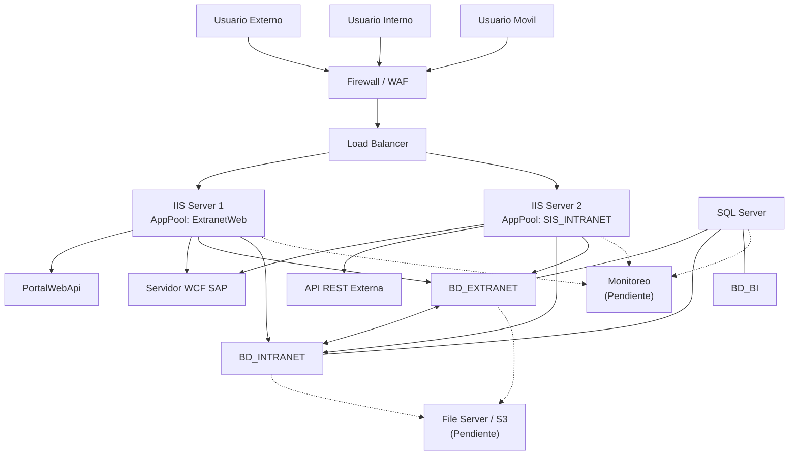

# Vista Fisica - Infraestructura de Servidores

## Diagrama

## Server Inventory

| Server | OS | Role | AppPool/Service |
|--------|----|------|----------------|
| IIS Server 1 | Windows Server 2016/2019 | Web Frontend | ExtranetWeb |
| IIS Server 2 | Windows Server 2016/2019 | Web Frontend | SIS_INTRANET |
| WCF SAP Server | Windows Server 2016 | Integration | ws_extranet/wcf.svc, wcfAgencia.svc |
| PortalWebApi Server | Windows/Linux | Auth Service | PortalWebApi |
| API REST Server | Windows/Linux | External Services | API REST Externa |
| SQL Server | Windows Server 2016/2019 | Database | SQL Server 2016/2019 |

## Network Zones

| Zone | Components | Access |
|------|------------|--------|
| External | Users | Public |
| Perimeter | WAF, Load Balancer | Port 443 |
| DMZ | IIS Servers | Port 80 (from LB) |
| Services | WCF, APIs | Restricted to DMZ |
| Data | SQL Server | Restricted to App Servers |
